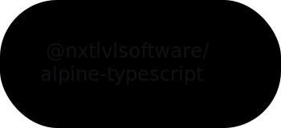

<h1 align="center">
  Alpine.js Typescript components
</h1>

  <picture>
    <source media="(prefers-color-scheme: dark)" srcset="./.github/banner-dark.svg">
    <source media="(prefers-color-scheme: light)" srcset="./.github/banner-light.svg">
    
  </picture>

<h4 align="center">
  Define your component logic in classes with added type safety.
    
  Based on <a href="https://github.com/archtechx/alpine-typescript">archtechx/alpine-typescript</a> with
  <a href="./tsconfigs">tsconfigs</a> from <a href="https://github.com/withastro/astro/tree/main/packages/astro/tsconfigs">astro.js</a>.
   
</h4>

* [Installation](#installation)
* [Usage](#usage)
    * [Setup](#setup)
    * [Defining Components](#defining-components)
		* [Generic Objects](#generic-objects)
		* [Classes](#typescript-classes)
    * [Using Components](#using-components)
* [Contributing](#contributing)
    * [Issues](#issues)
* [License](#license-information)

## About
Text

### Installation
Guide

### Usage
Text

#### Setup
Guide

#### Defining Components
Guide

##### Generic Objects
##### Typescript Classes

#### Using Components
Guide

## Contributing

#### Issues
Found a problem with this project? Make sure to open an issue on the [issue tracker](https://github.com/NxtLvLSoftware/alpine-typescript/issues)
and we'll do our best to get it sorted!

## License Information
[`nxtlvlsoftware/alpine-typescript`](https://github.com/NxtLvlSoftware/alpine-typescript) is open-sourced software, freely available to use under the terms of the
[MIT License](https://www.techtarget.com/whatis/definition/MIT-License-X11-license-or-MIT-X-license).

__A full copy of the license is available [here](../LICENSE).__

> THE SOFTWARE IS PROVIDED "AS IS", WITHOUT WARRANTY OF ANY KIND, EXPRESS OR
> IMPLIED, INCLUDING BUT NOT LIMITED TO THE WARRANTIES OF MERCHANTABILITY,
> FITNESS FOR A PARTICULAR PURPOSE AND NONINFRINGEMENT. IN NO EVENT SHALL THE
> AUTHORS OR COPYRIGHT HOLDERS BE LIABLE FOR ANY CLAIM, DAMAGES OR OTHER
> LIABILITY, WHETHER IN AN ACTION OF CONTRACT, TORT OR OTHERWISE, ARISING FROM,
> OUT OF OR IN CONNECTION WITH THE SOFTWARE OR THE USE OR OTHER DEALINGS IN THE
> SOFTWARE.

#

__A [NxtLvL Software Solutions](https://github.com/NxtLvLSoftware) product.__
